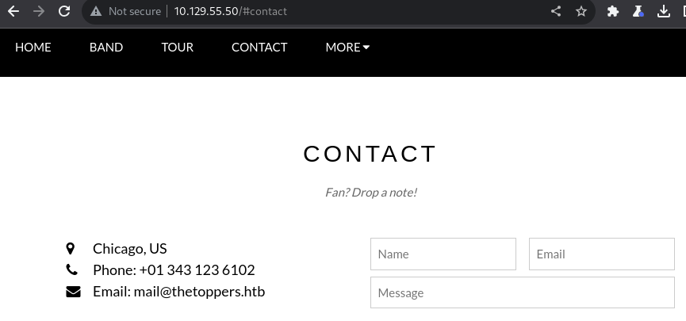

<span style="color:cyan">**Question 1**</span>: How many TCP ports are open?

I used nMap to identify open ports and services.

```
cmd : nmap IP -sV -sC -v IP address

PORT   STATE SERVICE VERSION
22/tcp open  ssh     OpenSSH 7.6p1 Ubuntu 4ubuntu0.7 (Ubuntu Linux; protocol 2.0)
| ssh-hostkey: 
|   2048 178bd425452a20b879f8e258d78e79f4 (RSA)
|   256 e60f1af6328a40ef2da73b22d1c714fa (ECDSA)
|_  256 2de1874175f391544116b72b80c68f05 (ED25519)
80/tcp open  http    Apache httpd 2.4.29 ((Ubuntu))
|_http-server-header: Apache/2.4.29 (Ubuntu)
| http-methods: 
|_  Supported Methods: GET HEAD POST OPTIONS
|_http-title: The Toppers
Service Info: OS: Linux; CPE: cpe:/o:linux:linux_kernel

NSE: Script Post-scanning.
Initiating NSE at 11:30
Completed NSE at 11:30, 0.00s elapsed
Initiating NSE at 11:30
Completed NSE at 11:30, 0.00s elapsed
Initiating NSE at 11:30
Completed NSE at 11:30, 0.00s elapsed
Read data files from: /usr/bin/../share/nmap
Service detection performed. Please report any incorrect results at https://nmap.org/submit/ .
Nmap done: 1 IP address (1 host up) scanned in 76.09 seconds
```

So there are `2` open TCP ports

    2

<span style="color:cyan">**Question 2**</span>: What is the domain of the email address provided in the "Contact" section of the website?

I start by connecting on the syte and navigate true the contact section, to see the email address



here I can see the domain

    thetoppers.htb

<span style="color:cyan">**Question 3**</span>: In the absence of a DNS server, which Linux file can we use to resolve hostnames to IP addresses in order to be able to access the websites that point to those hostnames?

If you want your computer to know which IP address corresponds to a specific domain name without consulting an external DNS server, you can specify this mapping in the "/etc/hosts" file. It's a way to resolve domain names locally without making requests to an external DNS server.

    /etc/hosts 

<span style="color:cyan">**Question 4**</span>: Which sub-domain is discovered during further enumeration?

At first i add the host: 

```
cmd : echo "IP thetoppers.htb" >> /etc/hosts
```

Then I Use the `Gobuster` command to perform a scan of the virtual subdomains of the website `http://thetoppers.htb/` using a list of possible subdomains from a keyword file."

    s3.thetoppers.htb

<span style="color:cyan">**Question 5**</span>: Which service is running on the discovered sub-domain?

The subdomain s3.thetoppers.htb strongly suggests the use of Amazon S3 

    amazon s3

<span style="color:cyan">**Question 6**</span>: Which command line utility can be used to interact with the service running on the discovered sub-domain?

to interact with the service running on the discovered sub-domain I can use  AWS Command Line Interface (AWS CLI).

<span style="color:cyan">**Question 7**</span>: Which command is used to set up the AWS CLI installation?

To set up the AWS Command Line Interface (CLI), you typically use the `aws configure` command.

    aws configure

<span style="color:cyan">**Question 8**</span>: What is the command used by the above utility to list all of the S3 buckets?

aws s3 ls

<span style="color:cyan">**Question 9**</span>: This server is configured to run files written in what web scripting language?

    PHP

<span style="color:cyan">**Question 10**</span>: Submit root flag


