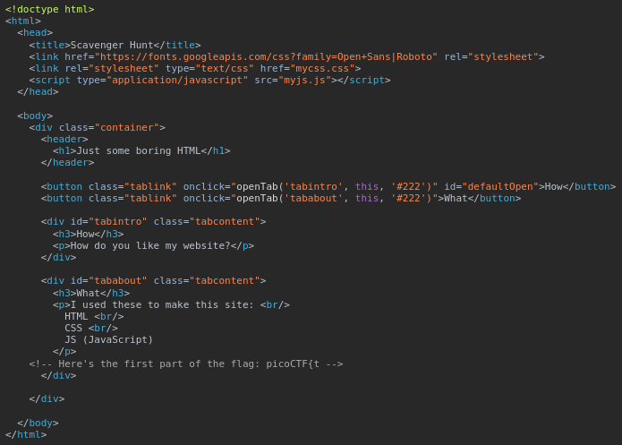

There is some interesting information hidden around this site http://mercury.picoctf.net:27278/. Can you find it?

At first I connected to the site, and I landed on this page: 


So I started as usual by inspecting the site, and I found the first part of the flag in the `index` HTML file:



Then i looked in `myjs.js`: 


Searching online, I found a lot of information about the `robots.txt` file and how webmasters can create it to instruct web crawlers on how to behave when they visit their website.

So I tried accessing it by adding `robots.txt` at the end of the URL, and I obtained this:

```
User-agent: *
Disallow: /index.html
# Part 3: t_0f_pl4c
# I think this is an apache server... can you Access the next flag?
```

So I have to find another part of the flag. I know that the `.htaccess` file is a configuration file used by the Apache web server to control various aspects of website behavior on a per-directory basis. I tried accessing it:

```
# Part 4: 3s_2_lO0k
# I love making websites on my Mac, I can Store a lot of information there.
```

Another part of the flag, another comment, another part of the flag to find!

Searching online, I found that there's a file named .DS_Store, used by the macOS operating system to store folder display settings. Maybe the hint with the word `store` refers to this file, so I tried accessing it:

```
Congrats! You completed the scavenger hunt. Part 5: _a69684fd}
```
I have the flag!

    picoCTF{th4ts_4_l0t_0f_pl4c3s_2_lO0k_a69684fd}